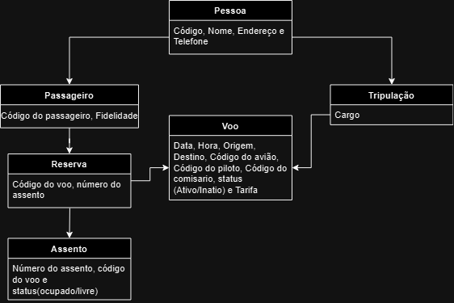

# Diagrama UML

No desenvolvimento deste aplicativo, criamos um diagrama UML (Unified Modeling Language) para representar de forma clara e visual a estrutura e o comportamento do sistema. O diagrama UML ajuda a entender a interação entre os diferentes componentes do app, como suas classes, objetos e relacionamentos, facilitando a análise e o desenvolvimento das funcionalidades.

Este diagrama foi uma etapa essencial para garantir que o projeto seguisse uma arquitetura bem definida e alinhada com os requisitos estabelecidos.

Abaixo, você pode conferir o diagrama UML que criamos para o aplicativo:

  

